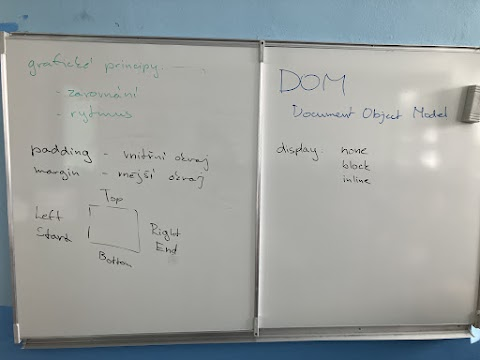

# Hodina 24.11.

# Zápisky z webových aplikace

- V HTML a CSS existují klíčové grafické principy, které ovlivňují vizuální prezentaci webových stránek. Margin určuje vnější odsazení prvků, zatímco padding nastavuje vnitřní odsazení. Display definuje způsob zobrazení prvku, může být například block, inline nebo flex. Současně je Document Object Model (DOM) důležitý pro manipulaci s obsahem stránky pomocí JavaScriptu, což umožňuje dynamickou aktualizaci a interakci s webovými stránkami. 
- Tyto principy společně poskytují prostředky pro efektivní ovládání a úpravu vizuálního designu webových stránek.

